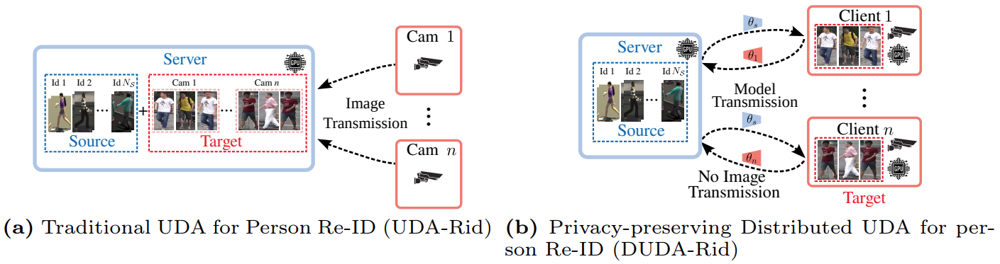
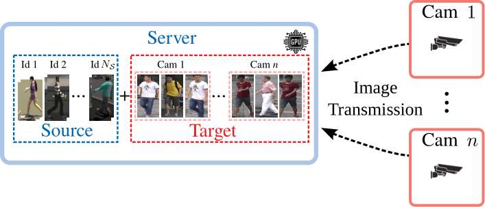
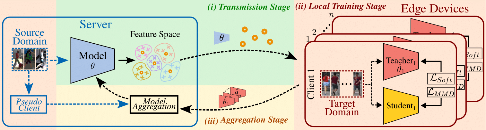

# Source Guided Similarity Preservation (S2P)
This repository contains the code for the paper "Privacy-Preserving Adaptive Re-Identification without Image Transfer" (ECCV 2024).

# [Overview](#contents)

Re-Identification systems (Re-ID) are crucial for public safety but face the challenge of having to adapt to environments that differ from their training distribution.
Furthermore, rigorous privacy protocols in public places are being enforced as apprehensions regarding individual freedom rise, adding layers of complexity to the deployment of accurate Re-ID systems in new environments.

In this work, we present a novel setting for privacy-preserving Distributed Unsupervised Domain Adaptation for person Re-ID (DUDA-Rid) to address the problem of domain shift without requiring any image transfer outside the camera devices.
To address this setting, we introduce Fed-Protoid, a novel solution that adapts person Re-ID models directly within the edge devices.
Our proposed solution employs prototypes derived from the source domain to align feature statistics within edge devices.
Those source prototypes are distributed across the edge devices to minimize a distributed Maximum Mean Discrepancy (MMD) loss tailored for the DUDA-Rid setting.

Our experiments provide compelling evidence that Fed-Protoid outperforms all evaluated methods in terms of both accuracy and communication efficiency, all while maintaining data privacy.

<p align="center">
    
</p>
<!--   -->
<!-- <p float="left">
  >
</p> -->

For more details, please refer to our [paper]().

# [Framework Architecture](#contents)
<p align="center">
    
</p>

# [Updates](#contents)

[10/07/2024] `S2P` v0.1.0 is released.

# [Installation](#contents)

Please refer to [INSTALL.md](OpenUnReID/docs/INSTALL.md) for installation and dataset preparation.

# [Get Started](#contents)
## Training
To train S2P on MSMT17 as source domain and Market1501 as target domain, run the following command:
+ Distributed training in a slurm cluster:
```shell
sbatch Fedprotoid.sh
```
+ Distributed training locally with multiple GPUs:
```shell
sh run_train.sh ${RUN_NAME} --epochs 10 --iters 120 --KDloss 0.1 --MMDloss 0.1 
```
## Arguments
+ `RUN_NAME`: the name of the experiment. Logs and checkpoints will be saved in `logs/${RUN_NAME}/`.
+ `--epochs`: the number of training epochs.
+ `--iters`: the number of training iterations.
+ `--KDloss`: the weight of the knowledge distillation loss.
+ `--MMDloss`: the weight of the MMD loss.
+ Refer to run_s2p_train.sh for more arguments. METHOD can be MMT or SpCL.
+ [optional arguments]: please refer to [config.yaml](OpenUnReID/tools/MMT/config.yaml) to modify some key values from the loaded config of the specified method (Support MMT and SpCL).

## Datasets


# [Acknowledgement](#contents)

This repository is built upon [OpenUnReID](https://github.com/open-mmlab/OpenUnReID)